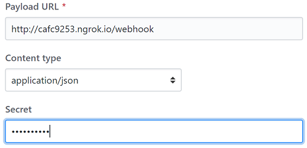

# Self-hosted Configurations

If you're using your own server to host our solution, there's a few things you need to setup.

## Environment Variables

- `DEFAULT_CONFIGURATION_FILE`: url **[REQUIRED]**

  The URL of the default `.rulesrc` file

- `ENCRYPTION_KEY`: secret passphrase **[REQUIRED]**

  Used to encrypt user's tokens

- `APPLICATION_NAME`: the name of the App **[REQUIRED]**

  Will appear on the commit status.

- `APPLICATION_URL`: the default URL of your application **[REQUIRED]**

  Used in the registration process

- `DISABLE_REMOTE_CONFIG`: true|false _[optional]_

  Specify if you allow to fetch the `.git-wehbooks/.rulesrc` file from the received hook. Otherwise, it uses the local `src/rules/.rulesrc`.

- `DATA_ACCESS`: "file" | undefined _[optional]_

  Specify the way you're accessing your data. By default, the app is fetching your mongo database.
  If you choose "file", it will store(and fetch) all users configurations into files.

- `MONGODB_CONNECTION_STRING` _[optional]_

  `mongodb://localhost/hygie` by default

- `NODE_ENV`: "production" | undefined _[optional]_

  Used by the LoggerService to add Timestamp and color in log (not set in production mode)

- `VERBOSE_LOGGER`: "true" | undefined _[optional]_

  Enable verbose mode in the LoggerService.

- `ANALYTICS_ID`: Google Analytics ID _[optional]_

  Used to send Rule and Post-Actions events to Google Analytics

- `WEBHOOK_SECRET`: string _[optional]_

  You can enable whitelisting by setting the `WEBHOOK_SECRET` env var. Every user who wants to use your app need to provide the secret in its Git's Webhook configuration.

  _Github Webhook_

  

  _Gitlab Webhook_

  

::: tip
Setting Environment Variables:

- Windows: `$env:DATA_ACCESS="file"`
- Linux: `export DATA_ACCESS=file`

:::

## Google API

The `SendEmailRunnable` makes use of Google API to send mails.

If you want to use the Runnable, you need to create the `crendentials.json` (located in the top level of your application) file as described [in the offical documentation](https://developers.google.com/gmail/api/quickstart/nodejs).

You just have to follow `Step 1` to get your credentials.

::: warning
The chosen account will be the sender (email `from` field) of all emails sended through the `SendEmailRunnable`.
:::

## Monitoring

### Google Analytics

As specified in the previous section, you can set the `ANALYTICS_ID` env var to enable _Hygie_ to send events.

For the moment, the app only send informations about the use of `Rule` and `Runnable`.
Everytime one of them is processed, an event is sent to Google Analytics, with the project emitter and the name of the `Rule` or `Runnable`.

This allows you to have an idea of their uses.

### Prometheus / Grafana

To monitor the system's health, we've created a `/metrics` endpoint.

This endpoint is fetched by [Prometheus](https://prometheus.io/) every 15 seconds, and provide informations about the system itself (CPU, RAM, etc), the number of requests and the time needed to process them.

We use [Grafana](https://grafana.com/) to create dashboard over Prometheus and visualize all usefull informations.

You can directly import our schema to visualize _Hygie_'s health informations [here](../dashboard.json).
